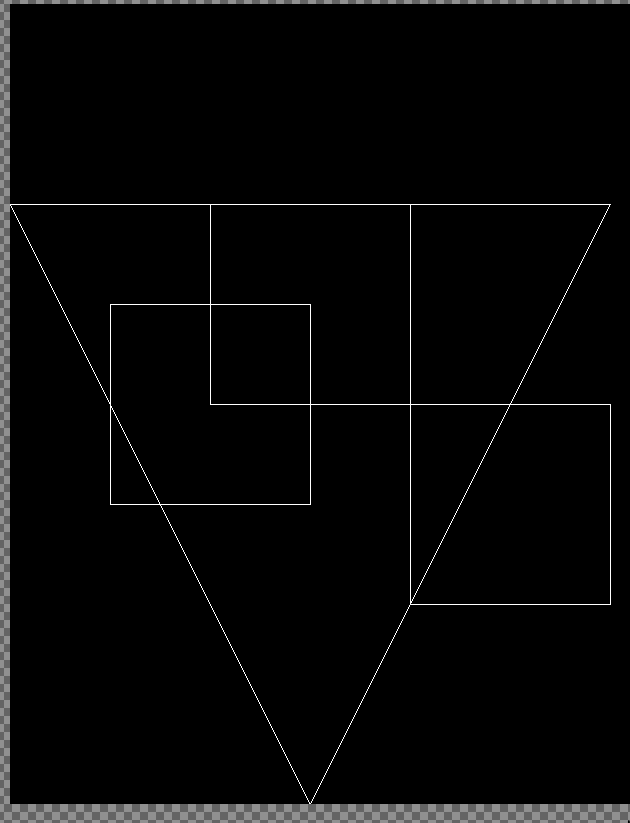
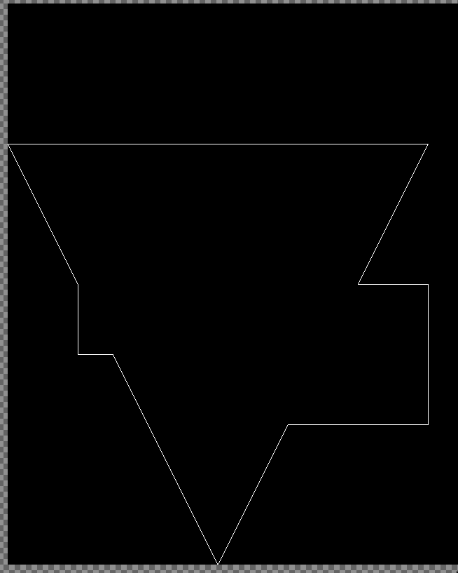

# Polygon Clipping in Rust

Motivated by the idea that the energy output of solar panels can be calculated more efficiently without sacrificing fidelity.
One of the most important factors in this calculation is the projection of shadow from one panel into every other panel which naturally leads to a O(n^2) complexity algorithm.
The industry currently bypasses this complexity limitation by abandoning a high-fidelity calculation and rasterizing the 3d scene and thus calculating shadow on a coarser grid. It's efficient but loses information.

The novel approach partly show here consists in projection the shadows of all panels at once, clip those shadows to get one final combined shadow and finally apply that to each panel. That leads to a 2\*O(n) algorithm.

This is a simple example of a number of polygons being input (which would represent shadows):

And this is the output of clipping all of them.

Tangential to the subject matter there's also an interesting implementation of a cyclic iterator worth checking out: 
